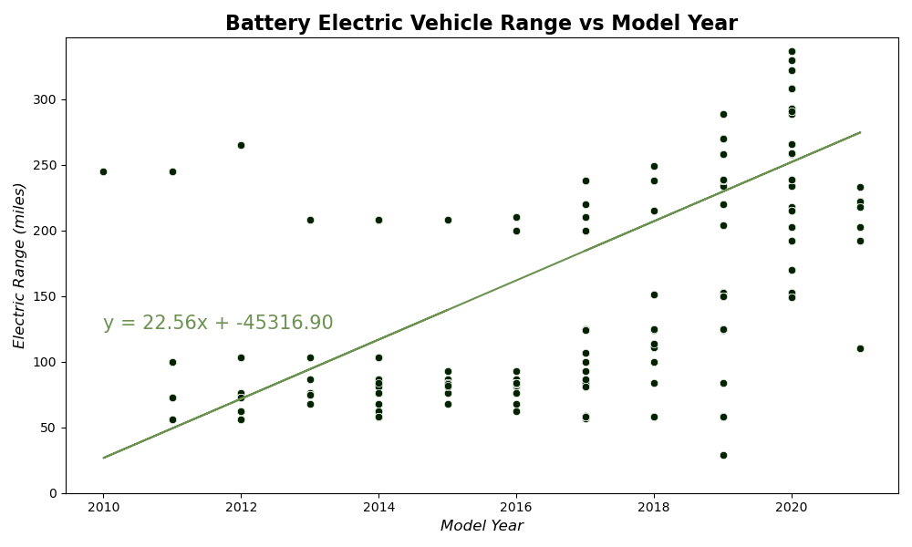

# Exploratory Data Analysis Project

## Deliverables

[Presentation](write-up_and_presentation/Final_Presentation.pdf)

[Written Report](write-up_and_presentation/EV%20Vehicles%20Registered%20in%20Washington%20State.pdf)

### Overview

In this project, we looked at [Electric Vehicle Population Data](https://www.kaggle.com/datasets/jainaru/electric-vehicle-population) in the state of Washington. This dataset includes information on all plug-in electric vehicles registered in Washington at the time of publishing. We used this data to analyze trends in purchasing habits for Washington residents.

### [Data Cleaning](data/data_cleaning.ipynb)

We cleaned our data to only include unique vehicles located in the state of Washington with complete location information. Then, for our range comparisons, we had to drop any vehicle without range data. This led to us using two sets of cleaned data for [popularity and location comparisons](data/clean_data/full_vehicle_data.csv) and [range comparisons](data/clean_data/range_cleaned_vehicle_data.csv). The only difference between the clean datasets is the inclusion of vehicles with "0" for their range value.

### [Most Popular Makes/Models](population_analysis/hypothesis_1_testing.ipynb)

As we initially expected, Tesla has the largest single market-share with over four times as many registered vehicles as the next most popular manufacturer, Nissan.

We expected the Model 3 to be the most popular EV since it is marketed as Tesla's budget model. As the graph shows, the Model Y has taken over the Model 3 in popularity among Washington residents. This could be because of the larger cargo area and increased seating for families.

### [Maps](maps/ev_data_maps.ipynb)

The first map shows locations for all electric vehicle registrations in our dataset.

The second map shows locations and electric vehicle types for all registrations in our dataset.

We were unable to draw any conclusions based on our dataset alone. Inclusion of third-party APIs would help to add context.

### [Model Year and Range Comparisons](range_and_model_year_comparisons/summary/rosensweig_ben_writeup.pdf)

Later model year BEVs are more popular the their PHEV counterparts.

PHEVs have a lower average range, most likely due to their petroleum-based engines. They do not need to rely completely on their electric motors and larger batteries to increase their overall range and efficiency. We can also see that their is a spike in registrations for the BEVs at around 215 miles of range. This is likely because this is the minimum amount of range for people to be comfortable with driving BEVs for daily use and road trips.

We unexpectedly got a negative correlation between model year and range for the full dataset, possibly due to the PHEVs being so concentrated in the lower right of the plot.

With just the BEVs, there is a positive correlation with an r-squared value of 0.51. A t-test yielded a p-value of 0.02.

### Conclusion

Based on our data and analysis, we can conclude that range is increasing for BEVs with each model year and this is contributing to their increasing popularity. We were limited by our dataset only containing current registrations, so year-over-year comparisons could not be made. Future work should be focused on analyzing location information to determine if proximity to charging stations affects purchasing habits or if economic factors are playing a role. Multi-year data should also be included to measure changes in BEV registrations over time.
